# Avaliação — Engenharia de Software
**Sistema Integrado de Gestão de Farmácia — MVP Definido pelo Estudante**

Aluno: Marcos Vhynycyus Gomes Da Silva 
RA: 24001369
Data: 26/03/2026  

---

# 1. Definição do MVP
Descreva aqui **qual parte do sistema** foi incluída no seu MVP.  
Explique claramente:

- O que está **dentro** do MVP  
- O que está **fora** do MVP  
- Por que você fez essas escolhas  

Exemplo de início:  
> “Meu MVP cobre o processo de venda desde a identificação/cadastro do cliente até a emissão do comprovante, incluindo tratamento de estoque insuficiente.”

## Dentro do MVP

As primeiras decisões que cobririam o desenvolvimento do sistema para que seja minimamente viavel, seria estrutura-lo de maneira que funcione de maneira orgânica e integrada.

O ponto inicial que seria a venda, estaria integrado com o estoque, produtos, clientes, contas a receber/recebidas e fiscal, seguindo o seguinte fluxo: 

- Venda realizada: Envolve escolha dos clientes, produtos, forma e meio de pagamento
- Quantidade vendida debitada do estoque: Vai envolver uma lógica de programação backend ou uma procedure no banco de dados 
- Produtos vinculados à venda para relatórios futuros: Produtos que seriam préviamente cadastrados, contendo controlhe de estoque e financeiro com margem de lucro baseado no preço de custo 
- Cliente vinculado à venda: Cliente também préviamente cadastra ou no momento da compra com dados de contato para possiveis cobranças de crediário 
- Em caso de venda a prazo, gere um contas a receber/crediário: Fornecerá um controlhe financeiro mais fino  
- E por final a emissão do documento fiscal: Deverá seguir todas a normas requisitadas pela SEFAZ para emissão de um documento fiscal, sendo o modelo mais comum a NFC-e

## Fora do MVP

E referente as melhorias/novas features que vão além do minimamente viável para utilização do produtos, estariam:

- Programa de desconto baseado em fidelidade dos clientes
- Relatórios personalizados com curva ABC para uma reposição inteligente das mercadorias 
- Controle financeiro de compras com cadastro de fornecedor
- Fluxo de caixa com processos de abertura, fechamento, sangria, suprimento, etc. Para um controlhe mais fino doque entra em espécio
- Controle de contas e integração bancária para emissão de boletos para crediário

## Justificativa

Dentro do fluxo apresentado que está dentro do MVP, foi descrito o minimo necessário para o funcionamento pleno do fluxo de vendas de pequenos até médios negócios, e que pode ser escalado de maneira organizada e eficiente com a features apresentadas fora do MVP

---

# 2. Regras de Negócio (mínimo: 5)
Liste e descreva **cada RN** de forma clara.

**RN01 — Cadastros de usuário separados por niveis de autorização, sendo eles atendente (Sem ter necessaŕiamente uma formação), financeiro (para controle de crediário), gerente (para direferentes aplicações de gestão e supervisão), farmaceutico (para venda de remédios com receita médica ou manipulados), adiministrador (Reservado a equipe de TI)**  
**RN02 — Venda de medicação controlada apenas liberada por autorização especial (Farmaceutico)**  
**RN03 — Cadastro dinâmico de clientes no momento da venda**  
**RN04 — Gerar crediário em casos de vendas a prazo**  
**RN05 — Emissão de comprovante de vendo e documento fiscal obrigatório em toda finalização de venda**  

(Adicione mais se quiser.)

---

# 3. Requisitos Funcionais (mínimo: 8)
Liste os requisitos funcionais do seu MVP (Minimal Viable Product).

**RF01 — Cadastro do cliente, contendo informações como CPF, RG, endereço e numero de telefone para contato**  
**RF02 — Identificação do cliente baseados nos dados cadastrados**  
**RF03 — Consunta de produtos eficiente com a busca baseada em número se série, cod. de barras ou nome**  
**RF04 — Exibição de dados do produtos, importante para visualização de dados como lote e datas de vencimento**  
**RF05 — Verificação do estoque do produto antes da venda**  
**RF06 — Validação de receituário médico para venda de medicação controlada**  
**RF07 — A finalização da venda deve exibir os dados de fechamento e permitir o lançamento a vista ou a prazo**  
**RF08 — No finalizar a venda deve ser emitido o comprovante de venda**  

(Adicione mais se quiser.)

---

# 🛡 4. Requisitos Não Funcionais (mínimo: 4)
Liste os RNFs do sistema conforme seu MVP.

**RNF01 — O algoritmo de consulta de produtos deve retornar a resposta em no máximo 5 segundos para 80% das consultas realizadas**  
**RNF02 — O controle de permissões de usuário deve ser vigilante 100% do tempo para evitar que certas operações sejam realizadas pelo usuário indevido**  
**RNF03 — A disponibilidade do sistema deve ser integral**  
**RNF04 — O backup dos dados deve ser realizado nos períodos de menor fluxo (23h ~ 3h) para manter a o funcionamento pleno do sistema**  

(Adicione mais se quiser.)

---

# 5. Casos de Uso (mínimo: 10)
### Inserir **diagrama de casos de uso geral**, demonstrando claramente:
- os 10 casos
- relação entre eles e atores
- pelo menos 3 includes
- pelo menos 3 extends

### Casos de uso
- UC01 — Identificar Cliente
- UC02 — Cadastrar Cliente
- UC03 — Consultar Produto
- UC04 — Verificar Estoque
- UC05 — Validar Receita
- UC06 — Registrar Venda
- UC07 — Finalizar Venda
- UC08 — Registrar Contas a Receber
- UC09 — Registrar Compra
- UC10 — Atualizar Estoque

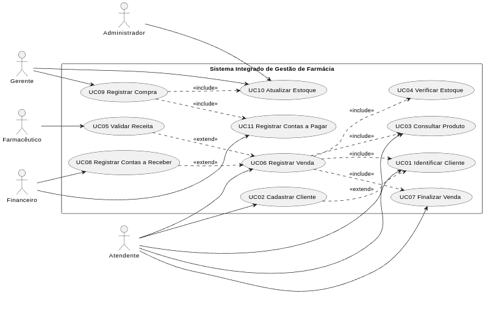

---

# 6. Documentação dos Casos de Uso
Para **cada caso de uso**, utilize o template abaixo:
---

## UC01 — Identificar Cliente
**Ator(es):** Atendente  
**Descrição:** Localizar cliente por CPF, nome ou telefone antes da venda.  
**Pré-condições:** Atendente autenticado no sistema.  
**Pós-condições:** Cliente identificado ou ausência de cadastro informada.

### Fluxo Principal
1. Atendente informa um dado do cliente.
2. Sistema pesquisa o cadastro.
3. Sistema exibe os dados encontrados.
4. Atendente confirma o cliente da venda.

### Fluxos Alternativos / Exceções
- FA01 — Cliente não encontrado; sistema informa ausência de cadastro.
- FA02 — Dado informado inválido; sistema solicita nova busca.

### Relacionamentos
- **Include:** —  
- **Extend:** UC02 — Cadastrar Cliente

### Diagrama de Atividade
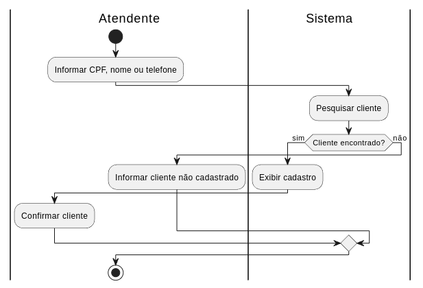

---

## UC02 — Cadastrar Cliente
**Ator(es):** Atendente  
**Descrição:** Registrar rapidamente um novo cliente durante o atendimento.  
**Pré-condições:** Cliente não localizado no UC01.  
**Pós-condições:** Cliente cadastrado e disponível para vinculação à venda.

### Fluxo Principal
1. Atendente seleciona cadastrar cliente.
2. Sistema solicita dados obrigatórios.
3. Atendente informa os dados.
4. Sistema salva o cadastro.

### Fluxos Alternativos / Exceções
- FA01 — CPF já cadastrado; sistema bloqueia duplicidade.
- FA02 — Dados obrigatórios ausentes; sistema solicita correção.

### Relacionamentos
- **Include:** —  
- **Extend:** UC01 — Identificar Cliente

### Diagrama de Atividade
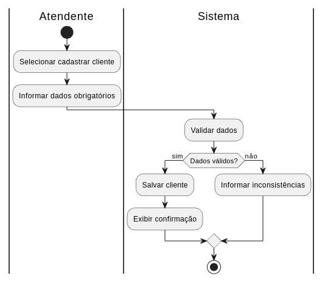

---

## UC03 — Consultar Produto
**Ator(es):** Atendente  
**Descrição:** Pesquisar produto por nome, código de barras ou fabricante.  
**Pré-condições:** Atendente autenticado.  
**Pós-condições:** Produto exibido para seleção ou inexistência informada.

### Fluxo Principal
1. Atendente informa critério de busca.
2. Sistema consulta os produtos.
3. Sistema exibe os resultados.
4. Atendente seleciona o produto desejado.

### Fluxos Alternativos / Exceções
- FA01 — Produto inexistente; sistema informa não encontrado.
- FA02 — Busca muito ampla; sistema solicita refinamento.

### Relacionamentos
- **Include:** —  
- **Extend:** —

### Diagrama de Atividade
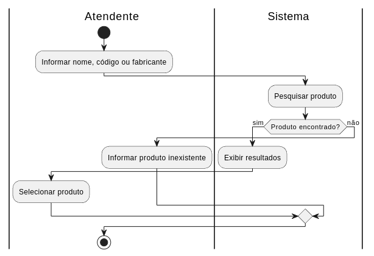

---

## UC04 — Verificar Estoque
**Ator(es):** Atendente  
**Descrição:** Confirmar disponibilidade do item na unidade antes da venda.  
**Pré-condições:** Produto selecionado.  
**Pós-condições:** Estoque validado ou indisponibilidade informada.

### Fluxo Principal
1. Atendente informa a quantidade desejada.
2. Sistema consulta o estoque da unidade.
3. Sistema compara quantidade solicitada e disponível.
4. Sistema retorna disponibilidade.

### Fluxos Alternativos / Exceções
- FA01 — Estoque insuficiente; sistema bloqueia continuidade.
- FA02 — Produto sem saldo; sistema informa indisponibilidade total.

### Relacionamentos
- **Include:** —  
- **Extend:** —

### Diagrama de Atividade
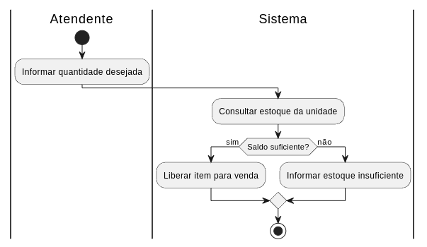

---

## UC05 — Validar Receita
**Ator(es):** Farmacêutico  
**Descrição:** Autorizar venda de medicamento controlado mediante receita válida.  
**Pré-condições:** Produto controlado incluído na venda.  
**Pós-condições:** Venda autorizada ou bloqueada.

### Fluxo Principal
1. Sistema identifica produto controlado.
2. Farmacêutico recebe solicitação de validação.
3. Farmacêutico confere a receita.
4. Sistema registra autorização.

### Fluxos Alternativos / Exceções
- FA01 — Receita inválida; sistema bloqueia a venda.
- FA02 — Farmacêutico indisponível; venda fica pendente.

### Relacionamentos
- **Include:** —  
- **Extend:** UC06 — Registrar Venda

### Diagrama de Atividade
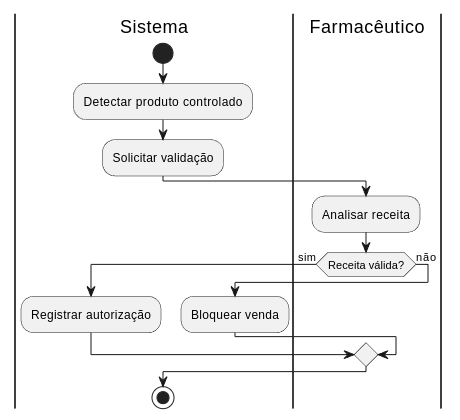

---

## UC06 — Registrar Venda
**Ator(es):** Atendente  
**Descrição:** Registrar os itens da venda e preparar o fechamento.  
**Pré-condições:** Atendente autenticado e produto consultado.  
**Pós-condições:** Venda registrada para finalização.

### Fluxo Principal
1. Atendente inicia a venda.
2. Sistema inclui cliente, produto e estoque no fluxo.
3. Atendente informa itens e quantidades.
4. Sistema monta o resumo da venda.

### Fluxos Alternativos / Exceções
- FA01 — Cliente não cadastrado; aciona UC02.
- FA02 — Produto controlado; aciona UC05.

### Relacionamentos
- **Include:** UC01, UC03, UC04, UC07  
- **Extend:** UC05, UC08

### Diagrama de Atividade
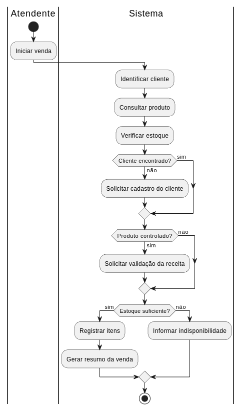

---

## UC07 — Finalizar Venda
**Ator(es):** Atendente  
**Descrição:** Confirmar forma de pagamento e concluir a operação.  
**Pré-condições:** Venda registrada.  
**Pós-condições:** Venda concluída e comprovante emitido.

### Fluxo Principal
1. Atendente revisa os dados da venda.
2. Sistema apresenta total e opções de pagamento.
3. Atendente seleciona a forma de pagamento.
4. Sistema conclui a venda e emite comprovante.

### Fluxos Alternativos / Exceções
- FA01 — Pagamento recusado; sistema cancela o fechamento.
- FA02 — Falha na emissão; sistema registra venda e sinaliza reimpressão.

### Relacionamentos
- **Include:** —  
- **Extend:** —

### Diagrama de Atividade
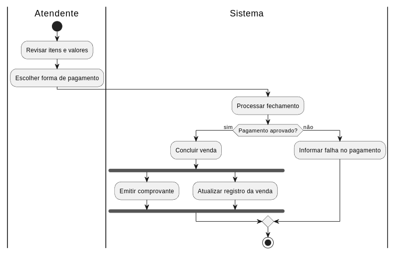

---

## UC08 — Registrar Contas a Receber
**Ator(es):** Financeiro  
**Descrição:** Gerar lançamento financeiro quando a venda for a prazo.  
**Pré-condições:** Venda a prazo concluída.  
**Pós-condições:** Conta a receber registrada com vencimento e status inicial.

### Fluxo Principal
1. Sistema identifica venda a prazo.
2. Sistema monta os dados do lançamento.
3. Financeiro confirma vencimento e condições.
4. Sistema grava a conta a receber.

### Fluxos Alternativos / Exceções
- FA01 — Dados financeiros incompletos; sistema não gera o lançamento.
- FA02 — Duplicidade de lançamento; sistema bloqueia gravação.

### Relacionamentos
- **Include:** —  
- **Extend:** UC06 — Registrar Venda

### Diagrama de Atividade
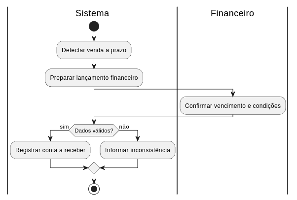

---

## UC09 — Registrar Compra
**Ator(es):** Gerente  
**Descrição:** Registrar compra de produtos de fornecedor para a unidade.  
**Pré-condições:** Fornecedor e produto cadastrados.  
**Pós-condições:** Compra registrada.

### Fluxo Principal
1. Gerente inicia o registro da compra.
2. Sistema solicita fornecedor, itens e quantidades.
3. Gerente informa os dados da compra.
4. Sistema grava a operação.

### Fluxos Alternativos / Exceções
- FA01 — Fornecedor inválido; sistema bloqueia o registro.
- FA02 — Item com dados incompletos; sistema solicita correção.

### Relacionamentos
- **Include:** UC10, UC11  
- **Extend:** —

### Diagrama de Atividade
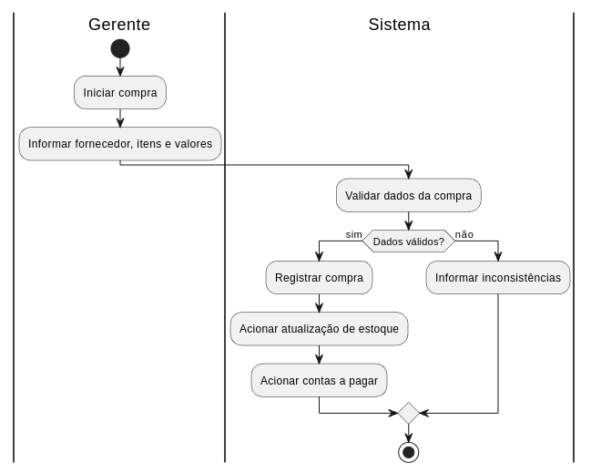

---

## UC10 — Atualizar Estoque
**Ator(es):** Gerente, Administrador  
**Descrição:** Atualizar saldo do estoque após compra, venda ou ajuste.  
**Pré-condições:** Existe movimentação válida ou autorização para ajuste.  
**Pós-condições:** Estoque da unidade atualizado.

### Fluxo Principal
1. Sistema recebe a origem da movimentação.
2. Sistema calcula a entrada ou saída.
3. Sistema atualiza o saldo do produto.
4. Sistema registra a movimentação.

### Fluxos Alternativos / Exceções
- FA01 — Saldo resultante inválido; atualização cancelada.
- FA02 — Falha de persistência; sistema mantém estoque anterior.

### Relacionamentos
- **Include:** —  
- **Extend:** —

### Diagrama de Atividade
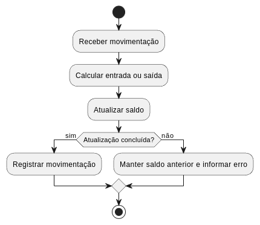
